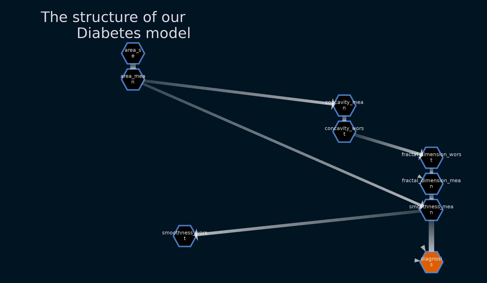

# Causal Inferencing

## Causal Graph



## Business Objective
A common frustration in the industry, especially when it comes to getting business insights from tabular data, is that the most interesting questions (from their perspective) are often not answerable with observational data alone. These questions can be similar to:
“What will happen if I halve the price of my product?”
“Which clients will pay their debts only if I call them?”

Judea Pearl and his research group have developed in the last decades a solid theoretical framework to deal with that, but the first steps toward merging it with mainstream machine learning are just beginning. 

The causal graph is a central object in the framework mentioned above, but it is often unknown, subject to personal knowledge and bias, or loosely connected to the available data. The main objective of the task is to highlight the importance of the matter in a concrete way.

## Skills Implemented in the Project
* Familiarity with the Causal Inferencing architectures
* Model management (building ML catalog containing models, feature labels, and training model version)
* Comparing multiple Causal Inferencing techniques; 
* Training and validating Causal Inferencing models; 
* Choosing appropriate architecture, loss function, and regularisers; hyperparameter tuning; choosing suitable evaluation metrics. 
* MLOps  with DVC, CML, and MLFlow


## Manual Installation
### Step 1: Downloading source code
```
git clone https://github.com/tutorialcreation/causality-module.git
```
### Step 2: Installation of dependencies
```
pip install -r requirements.txt
```
### Step 3: Check notebook
```
jupyter notebook
```
### Step 4: Visualize ML pipeline
```
dvc dag
```

## Automatic Installation
### Step 1: Docker
```
docker-compose up --build
```

## Modularized Script Tests
The tests from the modularized scripts are available in the following notebooks
* EDA analysis and Preprocessing ==> notebooks/eda_analysis.ipynb
* Featurization ==> notebooks/featurization.ipynb
* Causal Inferencing ==> notebooks/causal_graph.ipynb

